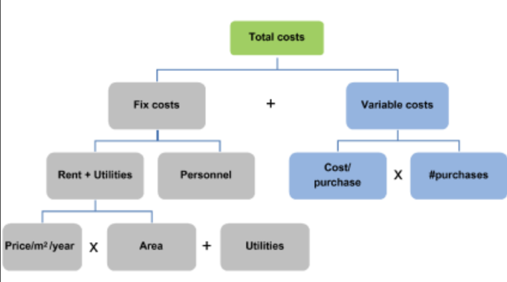

# Framework
- - - -
## PESTEL
ดูว่ามีอะไรที่ส่งผลกระทบกับเราในเชิง macro: มองภาพใหญ่ๆ
- P - Political: การเมือง นโยบายของรัฐ มีผลอะไรกับธุรกิจเรา
- E - Economic: เศรษฐกิจตอนนี้เป็นยังไง economic growth, interest rates, exchange rates, inflation rates, etc. มีอะไรที่มีผลกระทบต่อเรามั้ย
- S - Social: เช่น population growth, age distribution, health consciousness, career attitudes, etc.
- T - Technology: เทคโนโลยีใหม่ๆ เช่น 
	- New ways of producing goods and services
	- New ways of distributing goods and services
	- New ways of communicating with target markets
- E - Environment: factor เกี่ยวกับสิ่งแวดล้อม
- L - Legal: กฎหมาย
**Examples**
Case: มีโรงพิมพ์ใกล้เจ้งเพราะยอดขายลดลง
เค้ามาปรึกษาเรา ว่าจะมีทางออกยังไงบ้าง
1) เราต้องวิเคราะห์ระดับ macro ก่อน โดยใช้ PESTEL
- Political: -
- Economic: -
- Social: -
- Technology: 
	* social media บูมมากทำให้คนส่วนใหญ่หันไปทำ digital margeting -> ความต้องการงานพิมพ์ลดลง
	- Out of home media: ป้ายโฆษณา (ยังเยอะอยู่) แต่พักหลังเริ่มมีการใช้จอ LCD  มากขึ้นเพราะจอ LCD ถูกลง
	- Plan B ซึ่งเป็นบริษัทยักษ์ใหญ่ก็ใช้กระดาษลดลง ใช้ LCD มากขึ้น
	- ไม่ค่อยมีคนดูทีวี -> ลง ads กะ youtube, social
- Environment: ต้นไม้น้อยลง -> ต้นไม้แพง -> กระดาษแพงขึ้น
- Legal: -
PESTEL จะทำให้เราเข้าใจปัญหาในภาพกว้างๆเท่านั้น แต่ถ้าอยากวิเคราะห์ให้ลึกขึ้น ต้องใช้ framework อื่นๆมาช่วย เช่น PORTER 5 Forces
- - - -
## PORTER 5 Forces
พิจารณา threat จากด้านต่างๆว่าเกิดอะไรขึ้น + มีผลกระทบกับเรายังไง
หลักจะมีอยู่ 5 ด้าน

- Competitor: คู่แข่ง -> มีใครบ้าง + เค้าทำยังไงถึงแย่งลูกค้าเราไปได้
- Customer: กำลังการซื้อขอลูกค้าเราเป็นยังไง
- Supplier: คนที่เป็นคน supply ของให้เราเป็นไง
- Substitution: สิ่งที่มาทดแทนธุรกิจเรา
- New entry: ธุรกิจใหม่ๆ ที่มีผลกระทบกับเรา
**Examples**
Case เดิม: โรงพิมพ์ใกล้เจ้ง
เมื่อเราใช้ PESTEL มองภาพรวมแล้ว เราจะลองมาวิเคราะห์ด้วย porter 5 forces ว่าสิ่งที่มีผลกระทบมีอะไรบ้าง (มองละเอียดขึ้น)
- Competitor: เกิด Price war (แข่งกันลดราคาเพื่อแย่งลูกค้า)
- Customer: น้อยลง เพราะทุกคนหันไป paperless
- Supplier: กระดาษแพงขึ้น + เครื่องปริ้นท์ต้องซื้อใหม่ทุก 5 ปี
- Substitution: เครื่องปริ้นท์ตามบริษัท (แบบว่า ถ้าเราทำงานในบริษัท เราก็ใช้เครื่องปริ้นท์ของบริษัทเรา ไม่จำเป็นต้องไปปริ้นท์งานที่โรงพิมพ์)
- - - -
## MECE
(อันนี้ไม่ค่อยเกี่ยวอะไรกับ 2 อันบนเท่าไหร่)
Framework นี้หลักๆเอาไว้ใช้แบ่งงาน หรือประมาณจำนวน/มูลค่า Quantitative Accessment
ME - Mutually Exclusive: แต่ละ idea ต้องแยกจากกัน ไม่มีส่วน overlap
CE - Collectively Exhausive: พอเอาคำตอบจากทุกๆ idea มารวมกัน จะต้องได้คำตอบทั้งหมด ถ้าไม่รู้ว่าจะครบมั้ย เผื่อ choice อื่นๆไว้เพื่อความ save

ปกติเวลาทำ เราจะแตก tree ลงมา
เช่น เราอยากรู้ cost ของโรงงานเรา แต่ให้เราบอก total cost ทันทีเลยก็อาจจะยากไปหน่อย เราก็เลยแบ่งว่า cost ของโรงงานเรามาจากอะไรบ้าง ละเอาแต่ละอันมารวมกัน

สังเกตว่า Fix cost กับ variable cost ไม่ overlap กัน: ME
และ Fix cost + variable cost = total cost: CE
- - - -
## BCG Matrix
- - - -
## Mass Premium Model